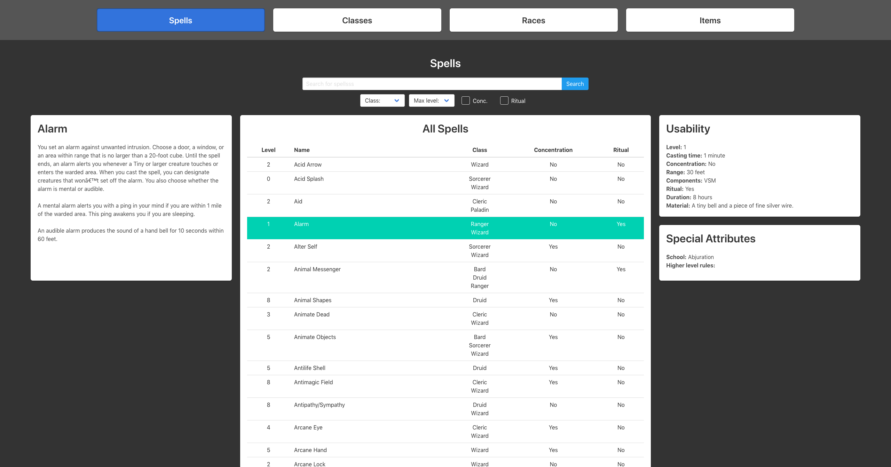

# Another DnD

AnotherDnD is another DnD website (ah!) that manages spells, characters, monsters, feats -- you name it!




<p align="center"><i>A current look at the site</i></p>

Since the website is in its early stages, we just want to get something up on the screen. If you're curious though, the roadmap is below all the configuration stuff.

Speaking of configuration stuff....


## Install

First, install `npm` with `homebrew`:

```
brew install node
```

Then, install local dependencies for the project:

```
npm install
```

That's it!

<hr>

To run the local server (Sass/Vue compiling, etc.), do the following:

```
npm run dev
```

(which really does `parcel index.html` in the background, because parcel is **awesome**.)


#### Building

When building, use `npm run build` for a generic build, and `npm run shortbuild` for a non-min, no-map version.

## Stack

Current dev stack, subject to change because n00bz

Backend: [Firebase](https://firebase.google.com/)
Frontend: [Vue.js](https://vuejs.org/), [Bulma](https://vuejs.org/), [Parcel](https://parceljs.org)


## Features

- wait do we need features i thought this was jus--


## Roadmap

- [x] View spells
- [ ] View classes
- [ ] View items
- [ ] View races
- [ ] Central datastore (vuexfire, vuex, etc.)
- [ ] Sort and filter all the things using said datastore
- [ ] Create your own items, monsters, etc.


## Super roadmap ("... I'll need a dev team and 2 years...")

- Connect party members together to share per-campaign items
- Bring 'er to market
- iOS app baybee
